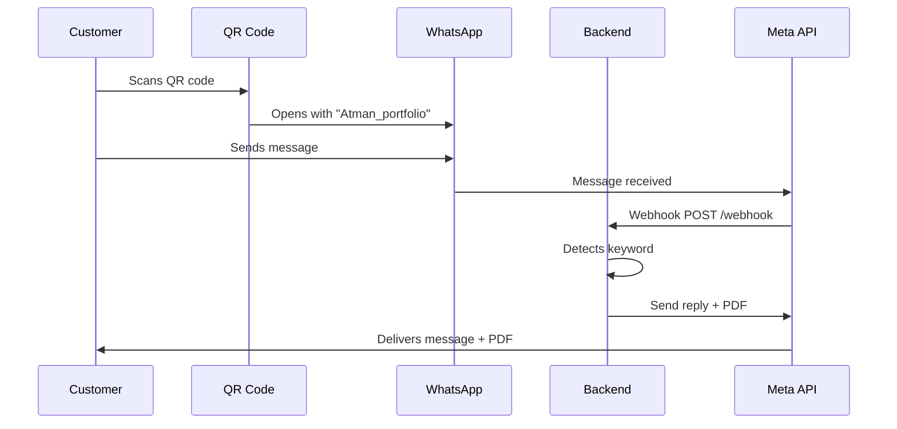

# WhatsApp Business API Integration - Quick Start

## 🎯 What Changed

Your QR code system now uses **WhatsApp Business API** for automated portfolio delivery:

**Before:** Customer sends message + PDF link to themselves → Customer has to send it manually

**After:** Customer sends "Atman_portfolio" → Backend automatically replies with message + PDF

---

## 📁 New Files Created

### Backend (in `/backend` folder)
- `server.js` - Express server with WhatsApp webhook
- `package.json` - Node.js dependencies
- `.env.example` - Environment variables template
- `SETUP_GUIDE.md` - Detailed Meta Business API setup
- `README.md` - Backend documentation
- `.gitignore` - Protects sensitive credentials

### Frontend Updates
- `js/config.js` - Now uses keyword "Atman_portfolio"
- `js/main.js` - Simplified message creation
- `index.html` - Updated UI text

---

## 🚀 Next Steps

### 1. Set Up Meta Business API (15-20 minutes)

Follow the detailed guide in [`backend/SETUP_GUIDE.md`](file:///c:/qr-whatsapp-sms/backend/SETUP_GUIDE.md)

Quick summary:
1. Create Meta Business Account
2. Set up WhatsApp Business API
3. Get Phone Number ID and Access Token
4. Configure environment variables

### 2. Deploy Backend (10 minutes)

**Recommended: Render (Free)**
1. Go to [render.com](https://render.com)
2. Create new Web Service
3. Upload `backend` folder or connect GitHub
4. Add environment variables from `.env.example`
5. Deploy and copy your webhook URL

### 3. Configure Webhook (5 minutes)

In Meta Business Suite:
1. Add your webhook URL: `https://your-app.onrender.com/webhook`
2. Set verify token (same as in `.env`)
3. Subscribe to `messages` field

### 4. Test It!

Send "Atman_portfolio" to your WhatsApp Business number → You should get automated reply with PDF!

---

## 🔧 Local Testing (Optional)

```bash
cd backend
npm install
# Create .env file with your credentials
npm start
```

Visit `http://localhost:3000/health` to verify configuration.

---

## 📝 How It Works



---

## 🔒 Security Notes

- Never commit `.env` file to Git
- Keep your Access Token secret
- Use HTTPS for webhook URL (required by Meta)
- Regularly rotate access tokens

---

## 🆘 Troubleshooting

| Issue | Solution |
|-------|----------|
| Webhook verification fails | Check `WEBHOOK_VERIFY_TOKEN` matches Meta config |
| Messages not received | Verify webhook subscription in Meta dashboard |
| PDF not sending | Ensure PDF URL is publicly accessible |
| Backend crashes | Check environment variables are set correctly |

Check backend logs for detailed error messages.

---

## 📚 Additional Resources

- [Meta WhatsApp Business API Docs](https://developers.facebook.com/docs/whatsapp/cloud-api)
- [Backend README](file:///c:/qr-whatsapp-sms/backend/README.md)
- [Setup Guide](file:///c:/qr-whatsapp-sms/backend/SETUP_GUIDE.md)
